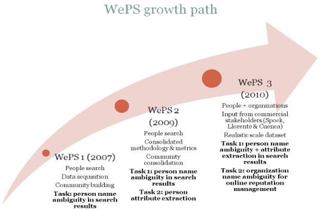

## Web People Search (WePS)

## Introduction

This repository contains resources for the three WePS evaluation campaigns. It includes the original data sets and gold standard so that researchers in **person name disambiguation**, **clustering** and **attribute extraction** can benchmark their approach to the tasks defined on these competitive evaluation campaigns.

## WePS-1
Held on June 23-24, 2007 in association with [Semeval](http://nlp.cs.swarthmore.edu/semeval/)/[ACL 2007](http://ufal.mff.cuni.cz/acl2007/) in Prague, Czech Republic.

### Organized by:
* [Javier Artiles](https://www.linkedin.com/in/javierartiles), [NLP & IR Group (UNED)](http://nlp.uned.es/)
* [Julio Gonzalo](http://nlp.uned.es/~julio), [NLP & IR Group (UNED)](http://nlp.uned.es/)
* [Satoshi Sekine](http://nlp.cs.nyu.edu/sekine/index.html), [Proteus Project (NYU)](http://nlp.cs.nyu.edu/)

### Task summary
This task focuses on the **disambiguation of person names** in a Web searching scenario. Finding people, information about people, in the World Wide Web is one of the most common activities of Internet users. Person names, however, are highly ambiguous. In most cases, therefore, the results for this type of search are a mixture of pages about different people that share the same name.

The participant's systems will receive as input, web pages retrieved from a web search engine using a given person name as a query. The aim of the task is to determine how many referents (different people) exist for that person name, and assign to each referent its corresponding documents. The challenge is to correctly estimate the number of referents and group documents referring to the same individual.

## WePS-2

Held on April 21st, 2009 co-located with the [WWW2009 conference](http://www2009.org/) in Madrid, Spain.

### Organized by:
* [Javier Artiles](https://www.linkedin.com/in/javierartiles), [NLP & IR Group (UNED)](http://nlp.uned.es/)
* [Julio Gonzalo](http://nlp.uned.es/~julio), [NLP & IR Group (UNED)](http://nlp.uned.es/)
* [Satoshi Sekine](http://nlp.cs.nyu.edu/sekine/index.html), [Proteus Project (NYU)](http://nlp.cs.nyu.edu/)

In this second evaluation 19 research teams from around the world have participated in two tasks: (i) **clustering web pages** to solve the ambiguity of search results, and (ii) **extracting 18 kinds of "attribute values"** for target individuals whose names appear on a set of web pages. Participants where provided with task guidelines and development data, and later evaluated their systems on a new testbed.

## WePS-3

Held on September 23 2010 as a [CLEF 2010](http://www.clef-initiative.eu/edition/clef2010/) *Lab* in Padova, Italy.

WePS-3 included two tasks concerning the Web entity search problem:

* **Task 1** is related to Web People Search and focuses on person name ambiguity and person attribute extraction on Web pages
* **Task 2** is related to Online Reputation Management (ORM) for organizations and focuses on the problem of ambiguity for organization names and the relevance of Web data for reputation management purposes.

### Background

The WePS campaign has been focused on the Web People Search problem in its first two editions: WePS 1 was run as a Semeval 1 task in 2007, where 16 teams submitted results (being one of the largest tasks in Semeval) and WePS 2 was run as a workshop of the WWW 2009 Conference, with the participation of 19 research teams.

The Web People Search task was defined in WePS as a problem of organization of web search results for a given person name. Web search engines return a ranked list of URLs which typically refer to various people sharing the same name. Ideally, the user would rather see documents in different clusters grouping documents that refer to the same individual, possibly with a list of person attributes that help deciding who is the actual person intended by the user.

From a practical point of view, the task is highly relevant: between 11 and 17% of web queries include a person name, 4% of web queries are just a person name, and person names are highly ambiguous: according to the US Census Bureau, only 90,000 different names are shared by more than 100,000,000 people. An indirect proof of the relevance of the problem is the fact that, since 2005, a number of web startups have been created precisely to address it (Spock.com and Zoominfo.com being the best known).

From a research point of view, the task is challenging (the number of clusters is not known a priori; the degree of ambiguity does not seem to follow a normal distribution; and web pages are noisy sources from which attributes and other indexes are difficult to extract) and has connections with Natural Language Processing and Information Retrieval tasks (Text Clustering, Information Extraction, Word Sense Discrimination) in the context of the WWW as data source.

### Goals

Our current proposal represents a third step in a growth path for WePS which is illustrated in the following figure.

### Tasks

WePS 1 and WePS 2 were focused on the people search task: in the first campaign we addressed only the name coreference problem, defining the task as clustering of web search results for a given person name. In the second campaign we refined the evaluation metrics and added an attribute extraction task for web documents returned by the search engine for a given person name.

For this third campaign we aim at merging both problems into one single task, where the system must return both the documents and the attributes for each of the different people sharing a given name. This is not a trivial step from the point of view of evaluation: a system may correctly extract attribute profiles from different URLs but then incorrectly merge profiles.

In addition, we want to consider another type of entity: organizations. Name ambiguity for organizations is a highly relevant problem faced by Online Reputation Management systems. Take, for instance, the online company Amazon. In order to trace mentions and opinions about Amazon in web data (including news and blog feeds and input from social networks), the system must filter out alternative senses of “Amazon” (the South American river, the nation of female warriors, etc.). But such filtering cannot be done by liberally adding keywords to a query (e.g. “amazon online store”), because that may harm recall, and recall is crucial for reputation management.

### Focus: implication of industrial stakeholders

WePS 1 and WePS 2 focused on consolidating a research community around the problem and an optimal evaluation methodology. In WePS 3 the focus is on implicating industrial stakeholders in the evaluation campaign, as providers of input to the task design phase and also as providers of realistic scale datasets. To reach this goal we have incorporated a representative from industry in each of the tasks:

For the Web People Search Task, co-coordinator Andrew Borthwick is principal scientist at Intelius, Inc., one of the main Web People Search services, which provides advanced people attribute extraction and profile matching from web pages.
For the Online Reputation Management task, co-coordinator Adolfo Corujo is Senior Director of Online Communication at Llorente & Cuenca, the leading communications consultancy firm in Spain and Latin America.

### Organizers

The general lab coordinators are:

* [Julio Gonzalo](http://nlp.uned.es/~julio) (UNED, Madrid).
* [Satoshi Sekine](http://nlp.cs.nyu.edu/sekine/index.html) (NYU, New York).

The coordinators for Task 1 (people search) are:

* [Javier Artiles](https://www.linkedin.com/in/javierartiles) (UNED, Madrid).
* [Andrew Borthwick](https://www.linkedin.com/in/borthwickandrew) (Intelius, Inc., Bellevue, Washington).

The coordinators for Task 2 (organizations search) are:

* [Bing Liu](http://www.cs.uic.edu/~liub/) (University of Illinois at Chicago).
* [Enrique Amigó](http://nlp.uned.es/~enrique/) (UNED, Madrid).
* [Adolfo Corujo](https://www.linkedin.com/in/adolfocorujo) (Llorente & Cuenca, Madrid).

Besides the track coordinators, WePS has a representative [Steering Committee](http://nlp.uned.es/weps/steering-committee).

### WePS-3 was sponsored by Intelius

Person attribute extraction and clustering are core technologies for Intelius.  Intelius' support of WePS-3 continues its history of support for research in this area, as shown by the $50,000 Spock Challenge (2007), which was sponsored by Intelius subsidiary, spock.com.  Intelius is actively hiring people with expertise in people record linkage and attribute extraction for its data research team.  Those interested should see our ad or contact Dr. Borthwick for more information. 